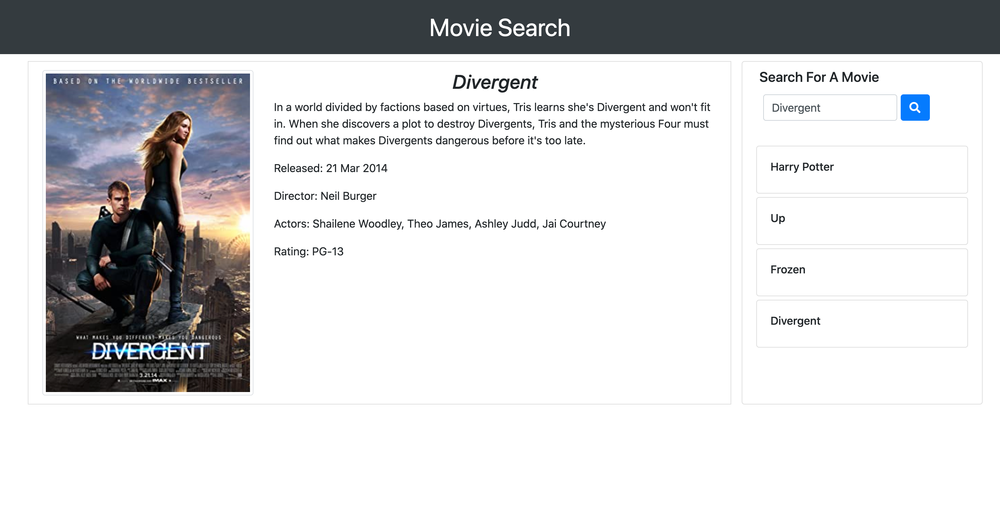

# Movie Search

## Description
This application features dynamically updated HTML to create a Movie Search Engine. Through the utilization of the OMDB API this application is able to retrieve the users searched movie information including: rating, release date, director, actors, plot, and movie poster. 

## Usage

* To search for a movie enter the title into the search box and press the blue search button to search the OMDB database.
* The searched movie data will appear on the left side of the webpage (as shown above), which includes rating, release date, director, actors, plot, and movie poster.
* Using the users local storage, the current sessions search history will be displayed on the right side of the webpage. The user can click on any of their previous searches and the movie's data will be displayed. When the user reopens the application, they will have the  last movie searched loaded onto the page..

## License
This project is licensed under the MIT license.

## Contributing
To contribute to this project you can fork this GitHub repository.

## Questions
If you have any additional questions about this application you can reach out to me at briannahebeler@gmail.com.
You can check out some of my other projects at briannahebeler (https://github.com/briannahebeler).

## Link
https://briannahebeler.github.io/movie-search/